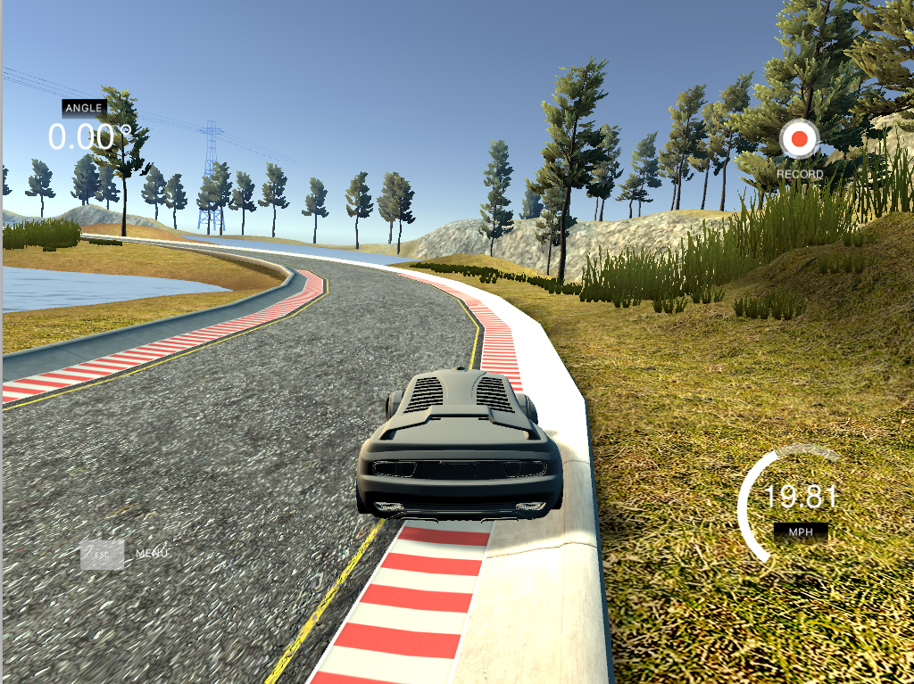
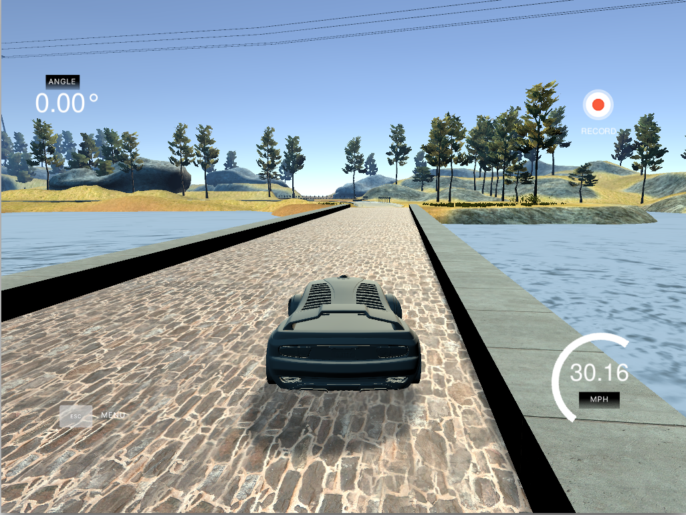
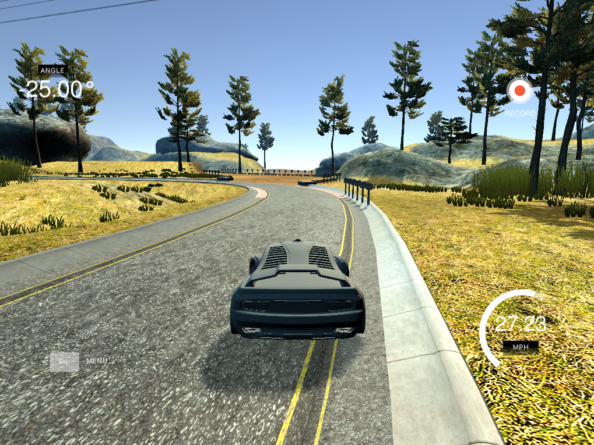
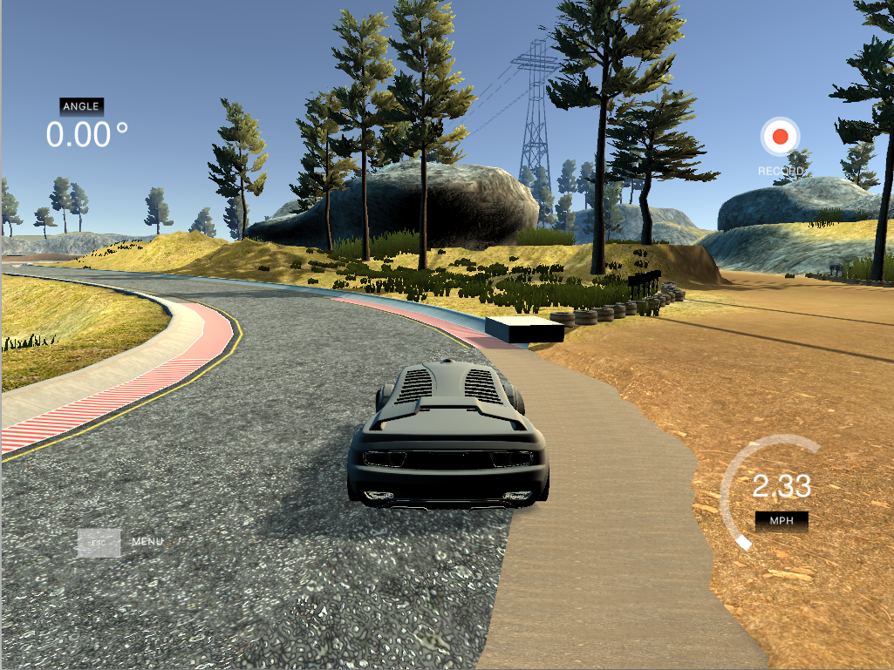

## Deep Learning: Behavioral Cloning Project

The goals of this project are the following:
* Build, a convolution neural network in Keras that predicts steering angles from images
* Train and validate the model with a training and validation set
* Test that the model successfully drives around in a simulator without leaving the road

[](https://www.youtube.com/watch?v=W6mD52oXCfw&feature=youtu.be)

My project includes the following files:
* model.py containing the script to create and train the model
* drive.py for driving the car in autonomous mode
* video.mp4 showing the car driving in autonomous mode
* model.h5 containing a trained convolution neural network 
* writeup_report.md summarizing the results

The model.py file contains the code for training and saving the convolution neural network. The file shows the pipeline I used for training and validating the model, and it contains comments to explain how the code works.

### Execution
Using the [Udacity Simulator](https://github.com/udacity/self-driving-car-sim) and my drive.py file, the car can be driven autonomously around the track by executing 
```sh
python drive.py model.h5
```

### Model Architecture and Training Strategy

#### 1. Model Architecture

My model first normalizes the data to a range of -0.5 and 0.5 using a Keras Lambda Layer (model.py lines 59). Then, 5 convolution neural network layer with different filter sizes and depths are added (model.py lines 61-65) . The model includes RELU layers to introduce nonlinearity. Finally, three fully connected layers are added.
The network architecture is basically the same as presented in ["End to End Learning for Self-Driving Cars"](http://images.nvidia.com/content/tegra/automotive/images/2016/solutions/pdf/end-to-end-dl-using-px.pdf).

#### 2. Attempts to reduce overfitting in the model

During training, the model uses dropout layers to reduce overfitting. These layers have been removed during final training which has been performed on a much larger dataset. For the final training, overfitting seemed not to be an issue anymore.
The model was tested by running it in the simulation and checking that the vehicle stays on the track.

#### 3. Model parameter tuning

The model is trained using the Adam optimizer. The learning rate was not tuned manually (model.py line 77).
I used 5 epochs, after which no more significant improvement could be achieved.

#### 4. Appropriate training data

Training data was chosen to keep the vehicle driving on the road. I used a combination of center lane driving, recovering from the left and right sides of the road. For specific situations when the model failed - additional training data where generated and the model has been retrained.
For details about how I created the training data, see the next section. 

### Model Architecture and Training Strategy

#### 1. Solution Design Approach

My first step was to use a convolution neural network as presented in "End to End Learning for Self-Driving Cars". I thought this model might be appropriate because it has been successfully applied for a similar task.

In order to gauge how well the model was working, I split my image and steering angle data into a training and validation set. I found that my first model had a low mean squared error on the training set but a high mean squared error on the validation set. This implied that the model was overfitting. 
To avoid overfitting, I added three dropout layer in the fully connected part of the network.

At the end, when much more training data were available - the mean squared error of training and validation set became almost equal even if I removed the dropout layer incrementally. Finally, there was no more need for them.

The final step was to run the simulator to see how well the car was driving around track one. There were a few spots where the vehicle fell off the track as the situation before and directly after crossing the bridge.
To improve the driving behavior in these cases, I added more data for these situation including driving on the center of the road as well as recovering if the vehcile was near the lane marking

At the end of the process, the vehicle is able to drive autonomously around the track without leaving the road.

#### 2. Final Model Architecture

The final model architecture (model.py lines 18-24) is exactly the same as presented in "End to End Learning for Self-Driving Cars" which already has been described in Section 1 (Model Architecture and Training Strategy)

#### 3. Creation of the Training Set & Training Process

To capture good driving behavior, I first recorded three laps on track one using center lane driving and one on the second track. Here is an example image of center lane driving on the first track from the simulator - directly extracting the image from the dataset was no possible due to the combination of a slow pc and tons of data:

 

I then recorded the vehicle recovering from the left side and right sides of the road back to center so that the vehicle would learn to recover after leaving the center of the road. These images show what a recovery looks like in different situations :






To augment the data sat, I flipped every image and the according angles to make the dataset more symmetric.

After the collection process, I had 31703 number of data points. The augmented dataset therefore included 31703*2 images.

I finally randomly shuffled the data set and put 20% of the data into a validation set. 

I used this training data for training the model. The validation set helped determine if the model was over or under fitting. The ideal number of epochs was 5 as evidenced by the almost static loss value
I used an adam optimizer so that manually training the learning rate wasn't necessary.
